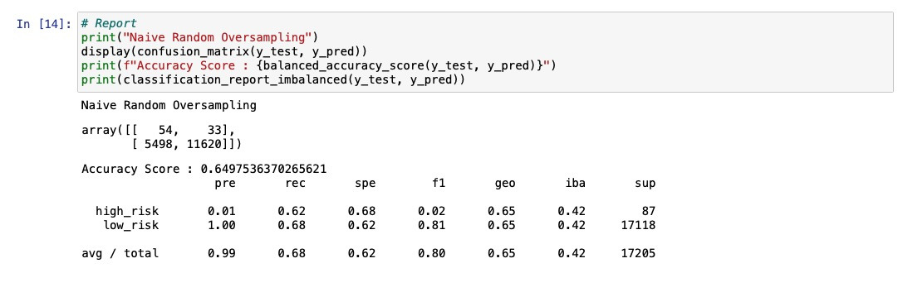
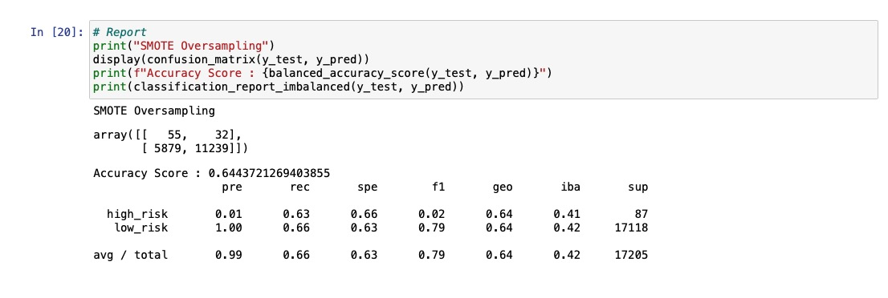
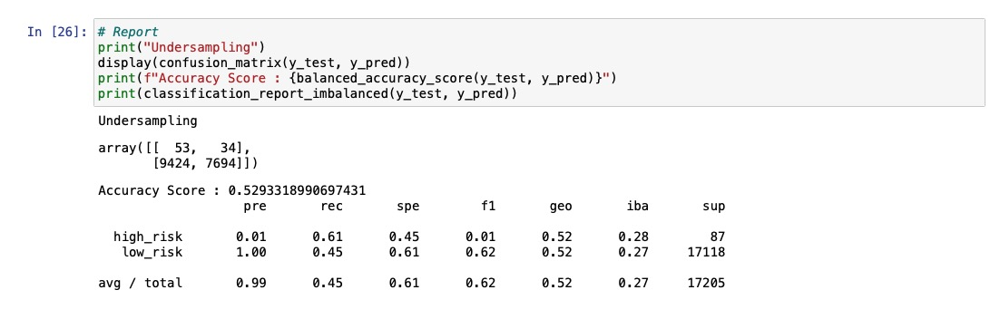
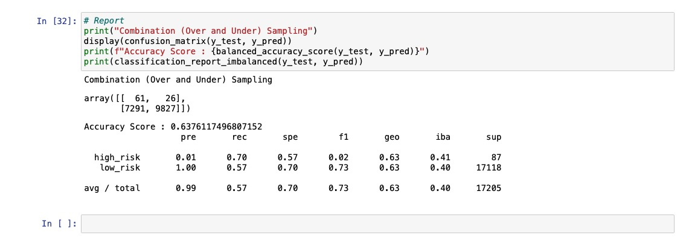
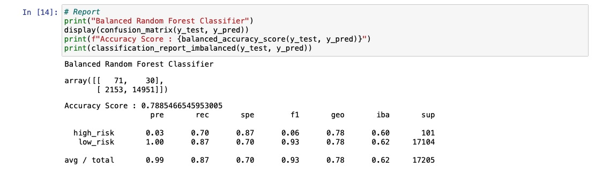
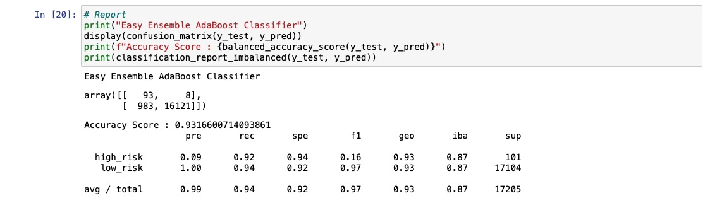

# Credit_Risk_Analysis

## Overview of the loan prediction risk analysis
- This project is designed to use the RandomOverSampler and SMOTE algorithms, and undersample the data using the ClusterCentroids algorithm. Then, using a combinatorial approach of over and undersampling using the SMOTEENN algorithm. And comparing two new machine learning models that reduce bias, BalancedRandomForestClassifier and EasyEnsembleClassifier, to predict credit risk.

## Results
### Naive Random Oversampling
- 
    - Accuracy Score: 64.9754%
    - Precision High Risk: 1%
    - Precision Low Risk: 100%
    - Recall High Risk: 62%
    - Recall Low Risk: 68%

### SMOTE_Oversampling
- 
    - Accuracy Score: 64.4372%
    - Precision High Risk: 1%
    - Precision Low Risk: 100%
    - Recall High Risk: 63%
    - Recall Low Risk: 66%

### Undersampling
- 
    - Accuracy Score: 52.9332%
    - Precision High Risk: 1%
    - Precision Low Risk: 100%
    - Recall High Risk: 61%
    - Recall Low Risk: 45%

### Combination_Sampling
- 
    - Accuracy Score: 63.7612%
    - Precision High Risk: 1%
    - Precision Low Risk: 100%
    - Recall High Risk: 70%
    - Recall Low Risk: 57%

### Balanced_Random_Forest_Classifier
- 
    - Accuracy Score: 78.8547%
    - Precision High Risk: 3%
    - Precision Low Risk: 100%
    - Recall High Risk: 70%
    - Recall Low Risk: 87%

### Easy_Ensemble_AdaBoost_Classifier
- 
    - Accuracy Score: 93.1660%
    - Precision High Risk: 9%
    - Precision Low Risk: 100%
    - Recall High Risk: 92%
    - Recall Low Risk: 94%

## Summary
- In delivery 1 & 2, for the first four models, the accuracy score is not as high as the last two model in delivery 3. 
- The EasyEnsembleClassifier model shows a recall rate of 92%, so it can detect almost all high-risk credits. On the other hand, due to low precision, many low-risk credits are still falsely detected as high-risk. however, the precision high risk has already been higher than other model. Therefore, I would recommendate on Easy_Ensemble_AdaBoost_Classifier to use.